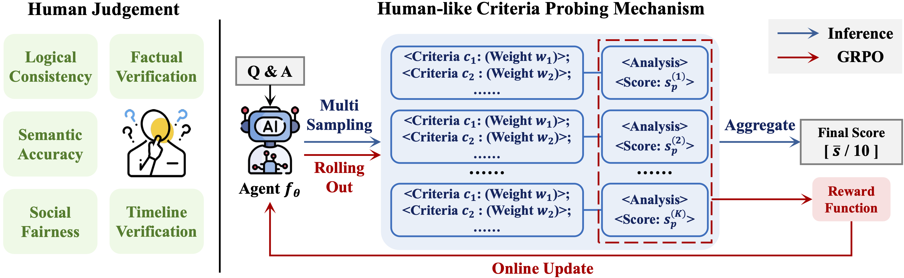

<h1 align="center">
     <br>Zero-source LLM Hallucination Detection with Human-like Criteria Probing
<p align="center">
    <a href="https://openreview.net/forum?id=s4Jn6bKYGI">
        
    </a>
</p>

<h4 align="center"></a>

>[Jiahao Yang](https://scholar.google.com/citations?view_op=list_works&hl=zh-CN&hl=zh-CN&user=q3JnCI4AAAAJ), Shuhai Zhang, Hailong Kang, Feng Liu, Qi Chen, Mingkui Tan
<!-- <sub>South China University of Technology, Pazhou Laboratory</sub> -->

<p align="center">
  
</p>

## ✨ Abstract

Large language models (LLMs) often hallucinate by generating factually incorrect or unfaithful content, posing significant risks to their safe use. Detecting such hallucinations is particularly challenging under the *zero-source constraint*, where no model internals or external references are available, and detection must rely solely on the textual query–answer pair. In this paper,  we propose *Human-like Criteria Probing* for Hallucination Detection (HCPD), a paradigm that emulates the multi-faceted reasoning of human evaluators. Its core is an *Human-like Criteria Probing* (HCP) mechanism, in which an LLM agent adaptively decomposes its judgment into a weighted set of interpretable criteria and aggregates criterion-specific scores into a final truthfulness measure. To achieve this adaptive capability, we introduce a reward-based alignment scheme using only weak supervision from semantic consistency. At inference, we employ a multi-sampling aggregation strategy to ensures robust decisions while preserving full interpretability. We further provide theoretical analysis supporting the reliability of our approach. Extensive experiments show that HCPD consistently outperforms state-of-the-art baselines, offering an effective and explainable solution for zero-source hallucination detection.

## ⚙️ Requirements

- **GPU:** 2 × NVIDIA RTX GPUs with 80 GB memory
- **CUDA:** 12.4
- **Python:** 3.11
- **PyTorch:** 2.6.0

## 💡 Virtual Environment

Create a virtual environment and install all required dependencies for training and evaluation.
```bash
bash setup.sh
conda activate HCPD
```

## 📂 Data and Pre-trained Models

- **Dataset:** We use four widely adopted QA benchmarks ([TriviaQA](https://huggingface.co/datasets/mandarjoshi/trivia_qa), [SciQ](https://huggingface.co/datasets/allenai/sciq) (train), [NQ Open](https://huggingface.co/datasets/google-research-datasets/nq_open), and [CoQA](https://downloads.cs.stanford.edu/nlp/data/coqa/coqa-dev-v1.0.json)) to construct the hallucination detection datasets. The generated datasets can be obtained and stored in `./generated_datasets` by running the command below:
```bash
bash generate_datasets.sh
```

- **Pre-trained models:** We adopt the [Qwen2.5-7B-Instruct](https://huggingface.co/Qwen/Qwen2.5-7B-Instruct) as the scoring agent and choose [Llama-3.1-8B](https://huggingface.co/meta-llama/Llama-3.1-8B), [Qwen3-8B](https://huggingface.co/Qwen/Qwen3-8B) as the evaluated target LLMs in the main experiments.

The datasets and pre-trained models will be automatically downloaded to `./.cache`. 
Alternatively, they can be downloaded manually from the corresponding official repositories. After downloading, please configure the **MODEL_PATH** in the run scripts.

## 🚀 Quick Start

Pretrained checkpoints are provided in [Google Drive](https://drive.google.com/file/d/15kD2ngCHMIytVomXq42drbQG4scEwXiB/view?usp=sharing). The results can be quickly verified using the following bash scripts.
```bash
bash quick_validation.sh
```

## ▶️ Main Experiments 

Training and evaluation pipelines are provided through the following bash scripts.

- TriviaQA:
```bash
bash run_TriviaQA.sh
```

- SciQ:
```bash
bash run_SciQ.sh
```

- NQ Open:
```bash
bash run_NQOpen.sh
```

- CoQA:
```bash
bash run_CoQA.sh
```

**Output Directory:** 
Model checkpoints generated during training are saved to `./data_{metric}`. Evaluation logs and test results are saved to `./logs`.


## 📖 Citation

If you find this work useful in your research, please consider citing:

```bibtex
@inproceedings{yang2026zerosource,
  title={Zero-source {LLM} Hallucination Detection with Human-like Criteria Probing},
  author={Jiahao Yang and Shuhai Zhang and Hailong Kang and Feng Liu and Qi Chen and Mingkui Tan},
  booktitle={Forty-third International Conference on Machine Learning},
  year={2026},
  url={https://openreview.net/forum?id=s4Jn6bKYGI}
}
```